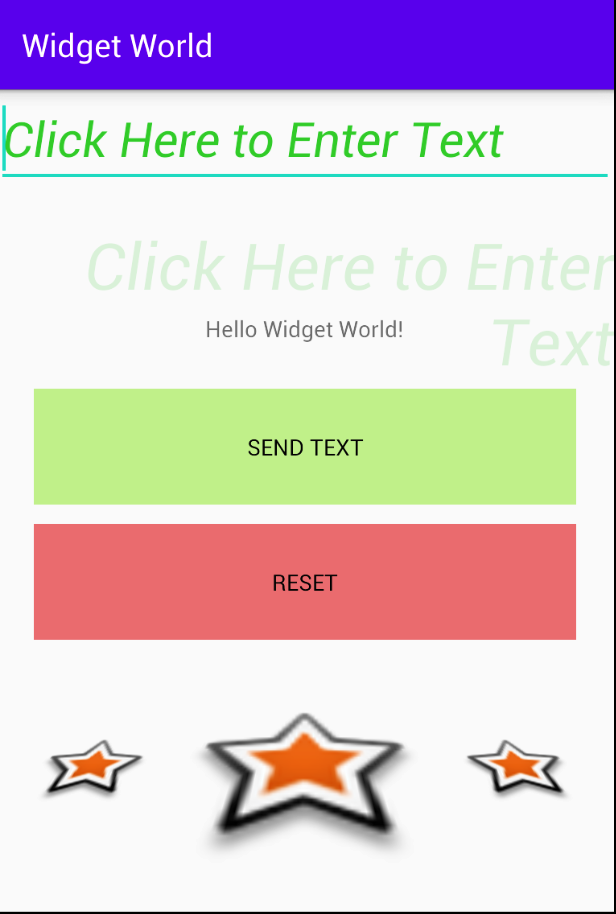
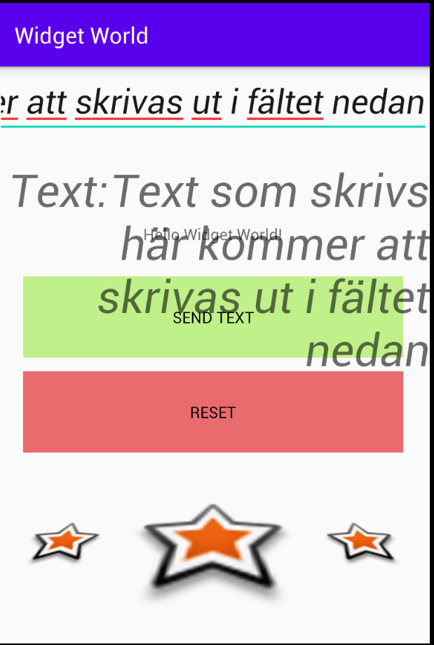

# Rapport

**Min rapport!**

Jag utgår i min rapport från den to-do-lista som fanns i Duggan:

## Add a layout of your choice, e.g. `LinearLayout`

Jag ville egentligen använda mig av defaultlayouten (constraint layout),
men kände mig nu manad att även inkludera en mindre LinearLayout.
Den är icke-funktionell och visar tre st små imageview-stjärnor.
Koden nedan är självförklarande vad gäller positionsbundenhet, storlek, ledning (horisontellt).
```
<LinearLayout
        android:layout_width="337dp"
        android:layout_height="167dp"
        android:orientation="horizontal"
        android:rotationX="45"
        app:layout_constraintEnd_toEndOf="parent"
        app:layout_constraintStart_toStartOf="parent"
        app:layout_constraintTop_toBottomOf="@+id/buttonReset">
```

## Add at least three different widgets inside that layout, e.g. `EditText`, `ImageView`, and `Button`
## use at least the margin attribute
## Position the widgets in a different way than the way they first appeared when added to the layout

## Button

Det finns två knappar. Såhär ser koden för Submit-knappen ut:
Koden nedan är självförklarande vad gäller positionsbundenhet, storlek, etc
```
    <Button
        android:id="@+id/buttonSubmit"
        android:layout_width="337dp"
        android:layout_height="72dp"
        android:layout_marginTop="28dp"
        android:text="@string/buttonSubmit"
        app:layout_constraintEnd_toEndOf="parent"
        app:layout_constraintHorizontal_bias="0.5"
        app:layout_constraintStart_toStartOf="parent"
        app:layout_constraintTop_toBottomOf="@+id/textView"
        android:background="#8892E334"
        android:textColor="@android:color/black" />
```

## Textview/EditView

Det finns två st Textview och ett Editview fält. Det sistnämnda är det som kodciteras nedan.
Koden nedan är självförklarande vad gäller positionsbundenhet, storlek, etc.
"Fill_parent" valdes av designskäl.
autofillHints är med för att Android Studio tyckte det var en utmärkt idé. Det tillför egentligen
inte något av värde då det är '@string/EditTextHint'-strängen som visas.

```
    <EditText
        android:id="@+id/EditText"
        android:layout_width="fill_parent"
        android:layout_height="wrap_content"
        android:autofillHints="Type what you want"
        android:hint="@string/EditTextHint"
        android:inputType="text"
        android:textColorHint="#2ECA2E"
        android:textSize="30sp"
        android:textStyle="italic"
        app:layout_constraintStart_toStartOf="parent"
        app:layout_constraintTop_toTopOf="parent" />
```

## ImageView

Det finns ett antal ImageView-element som alltså "visar" en bild.
Stjärnbilden kommer från de som fanns att plocka av från ImageView-elementet i Paletten i Design-vyn.
De är roterade x2, först enskilt och sen är LinearLayout roterad i X-led (vilket ger ett slags
djupkänsla eftersom (x)rotation då sker relativt utmed en x-axeln, dvs att stjärnan längst till vänster
får ett spegelvänd visuell förvrängning jämfört med den till höger, vilket skapar ett slags 3D-perspektiv)

```
        <ImageView
            android:id="@+id/imageViewStar8"
            android:layout_width="409dp"
            android:layout_height="155dp"
            android:layout_weight="1"
            android:contentDescription="@string/imageViewStar"
            android:rotationX="32"
            app:srcCompat="@android:drawable/star_big_on" />
```

## Övrigt

Huvudfunktionaliteti i appen är att skriva text i ett fält vänsterjusterad ('från vänster skriven')
som sedan med ett knapptryck kan skrivas ut i ett annat textfält med större fontstorlek, högerjusterad.
Jag använde följande artikel som referens när jag skapade submit/reset-funktionaliteten:

- https://www.studytonight.com/android/get-edittext-set-textview

Funktionaliteten i de två är följande:
Dvs kortfattat så skickas ett meddelande till Loggen,
sen i fallet med klick på "Submit" så skickas den inskrivna texten
i EditView-fältet som en textsträng till TextView-fältet med id:t "tvResult",
och i fallet med "Reset" så nollställs TextView-fälten och en ny text kan skrivas in.

```
        buttonSubmit.setOnClickListener(new View.OnClickListener() {
            @Override
            public void onClick(View view) {
                Log.d("==>","SubmitButton clicked");
                // get text from EditText user input
                String userinput = editText.getText().toString();
                result.setText("Text:\t" + userinput);

            }
        });

        buttonReset.setOnClickListener(new View.OnClickListener() {

            @Override
            public void onClick(View v) {
                Log.d("==>","ResetButton clicked");
                // clearing out all the values
                editText.setText("");
                result.setText("");
                editText.requestFocus();
            }
        });
```

Det var nog det. Skickar med två st Screenshots, tagna i Genymotion.

## Screenshots:

Screenshot1 visar appen utan ifylld text i textfältet.
Screenshot2 visar appen med ifylld text i textfältet.




